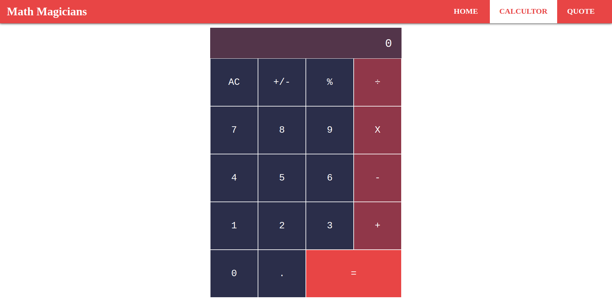

# Calculator(Al Hassiba in Arabic)

> This is a simple calculator project built using ReactJS, in this case I'm building it only for practicing more of ReactJS and it's libraries, hope that you like it.



## Built With

- ReactJS 17,
- ReactDOM 17,
- Webpack,
- Express,
- NodeJs,
- Babel
## Live Demo

[Live Demo Link](https://al-hassiba.herokuapp.com/)


## Getting Started
### Prerequisites
In order to have this project up and running you will need:

- NodeJS 10+
### Setup
First, you need to clone this project using one of the links above, using this command:

```Javascript

git clone RESPOSITRY_LINK

```

Then you should run: `npm install`

And afterward, you supposed to run: `npm run serve`, to run the project in your local machine.

Then head to the localhost on port 8080 `https://localhost:8080`

Congrats the project is fully working.

## Authors

👤 **Zakariae El Mejdki**

- Github: [@elmejdki](https://github.com/elmejdki)
- Twitter: [@zakariae_elmejdki](https://twitter.com/zakariaemejdki)
- Linkedin: [Zakariae El Mejdki](https://www.linkedin.com/in/zakariaeelmejdki/)

## 🤝 Contributing

Contributions, issues and feature requests are welcome!

Feel free to check the [issues page](https://github.com/elmejdki/calculator/issues).

## Show your support

Give a ⭐️ if you like this project!

## 📝 License

This project is [MIT](lic.url) licensed.
